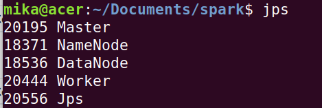
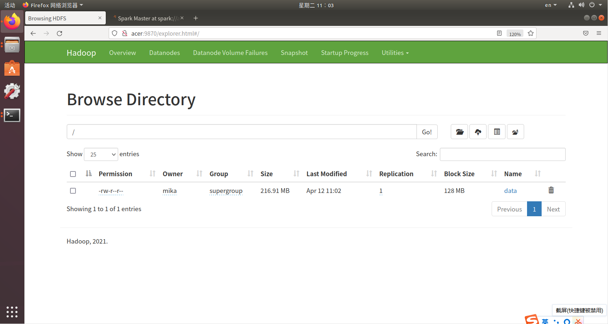

#### 虚拟机间ssh连接

`/etc/hosts`中保存了每个IP和对应的主机名，IP可能会经常变，要注意修改hosts！

`/etc/hostname`修改主机名


##### 不同主机上两台Ubuntu虚拟机之间如何ping通

首先关闭Windows防火墙和Linux防火墙

参考[不同的虚拟机之间怎么保证能互相ping通-百度经验 (baidu.com)](https://jingyan.baidu.com/article/29697b91c04e10ea20de3c9e.html)，将虚拟机设置中网络适配器修改为桥接模式，进入Ubuntu后`ifconfig`可发现IP已经变为主机网段。之后直接`ping ip`即可


##### ssh连接

- 首先，两台机器上都要安装openssh-server，`sudo apt-get install openssh-server`
- 保证双方可以互ping
- 在主节点上ssh对方`ssh user@hostname`，输入yes，输密码，即可远程控制对方的shell。

```shell
@@@@@@@@@@@@@@@@@@@@@@@@@@@@@@@@@@@@@@@@@@@@@@@@@@@@@@@@@@@
@    WARNING: REMOTE HOST IDENTIFICATION HAS CHANGED!     @
@@@@@@@@@@@@@@@@@@@@@@@@@@@@@@@@@@@@@@@@@@@@@@@@@@@@@@@@@@@
```

如果出现上述文字，清空~/.ssh/known_hosts文件，再重新建立ssh连接


##### scp：基于ssh传输目录

`scp -r 本地path user@hostname:目的path  `

例如`scp -r ./hadoop user@hostname:~/Downloads/hadoop`

另一种传输方法是使用`/bin/xysnc`分发脚本：通过同步工具rsync将本机文件同步到其他节点的相同位置`xsync filename`。scp是复制，rsync避免复制相同内容


##### ssh免密登录

假设acer要免密访问lenovo，需要把本机的rsa公钥发给lenovo

```shell
ssh-keygen -t rsa
ssh-copy-id lenovo

ssh mika@lenovo # 无需再输密码
```


#### Hadoop配置

hdfs：Hadoop分布式文件系统。

hdfs的系统架构：一个主节点namenode，一个备用节点secondary node，若干从节点datanode

首先进行集群部署规划

| 虚拟机名 | acer（主节点）     | lenovo                      | dell     |
| -------- | ------------------ | --------------------------- | -------- |
| HDFS     | NameNode, DataNode | SecondaryNameNode, DataNode | DataNode |

##### 1.hadoop集群配置

进入`/home/mika/Documents/hadoop/etc/hadoop/`

（1）修改`hadoop-env.sh`中的`JAVA_HOME`

（2）修改`core-site.xml`（设置了文件访问端口9000）

```xml
<configuration>
    <!--namenode地址-->
    <property>
        <name>fs.defaultFS</name>
        <value>hdfs://acer:9000</value>
    </property>
    <!--数据的存储目录-->
    <property>
        <name>hadoop.tmp.dir</name>
        <value>file:/home/mika/Documents/hadoop/tmp</value>
        <description>Abase for other temporary directories.</description>
    </property>
    <property>
        <name>hadoop.http.staticuser.user</name>
        <value>acer</value>
    </property>
</configuration>
```

（3）修改`hdfs-site.xml`

```xml
<configuration>
    <!--namenode的web端访问地址-->
    <property>
        <name>dfs.namenode.http-address</name>
        <value>acer:9870</value>
    </property>
    <!--2nd namenode的web端访问地址-->
    <property>
        <name>dfs.namenode.secondary.http-address</name>
        <value>lenovo:9868</value>
    </property>
    
    <property>
        <name>dfs.replication</name>
        <value>1</value>
    </property>
    <property>
        <name>dfs.namenode.name.dir</name>
        <value>file:/home/mika/Documents/hadoop/tmp/dfs/name</value>
    </property>
    <property>
        <name>dfs.datanode.data.dir</name>
        <value>file:/home/mika/Documents/hadoop/tmp/dfs/data</value>
    </property>
</configuration>
```


（4）修改`workers`

```
acer
lenovo
dell
```

使用xsync，分发到各节点


##### 2.启动hadoop集群

```shell
cd /home/mika/Documents/hadoop	# 先进入hadoop目录
rm -rf tmp 	                    # 删除tmp目录
# hadoop namenode -format       # 第一次时需要初始化
sbin/start-all.sh               # 非root模式运行，开启进程
jps                             # 查看当前进程

sbin/stop-all.sh 				# 关闭所有进程
```

- start-dfs（或start-all）后，访问hadoop的web页面http://acer:9870，或者`hdfs dfsadmin -report`查看节点数量是否正确。如果少节点，去该节点的logs目录下看日志，分析错误
- 要注意的是，主节点的`/etc/hosts`中的**127.0.xx.xx的IP要注释掉**，否则从节点无法访问到主节点的9000端口！
- 注意第一次启动hadoop时，一定要删除所有节点的tmp和logs目录，再初始化namenode，这样保证每个节点上的集群号ClusterID一致（在`hadoop/tmp/dfs/current/data/VERSION`中查看）。**之后再启动hadoop就不用再初始化了**


运行成功后，可以看到主节点上出现进程：namenode, datanode


从节点上：datanode


hadoop的web页面：可以看到3个节点


##### 3.spark配置

修改spark下的workers，参考[Spark 2.0分布式集群环境搭建_厦大数据库实验室博客 (xmu.edu.cn)](http://dblab.xmu.edu.cn/blog/1187-2/)

在`./sbin/spark-config.sh`末尾添加`JAVA_HOME`

xsync分发到各节点


##### 4.启动spark集群

```shell
# 启动
sbin/start-master.sh
sbin/start-slaves.sh

# 关闭
sbin/stop-master.sh
sbin/stop-slaves.sh
```

master节点jps后，可以看到出现Master, Worker进程；



slavers节点出现Worker进程


Spark的web页面：http://acer:8080，可以看到三个节点


##### start脚本启动所有进程

为了方便，可编写脚本`/home/mika/Documents/start.sh`，通过`./start.sh`运行

```shell
#!/bin/bash
cd /home/mika/Documents/hadoop
sbin/start-all.sh
cd /home/mika/Documents/spark
sbin/start-master.sh
sbin/start-slaves.sh
jps
```


##### stop脚本停止所有进程

`/home/mika/Documents/stop.sh`停止所有进程，通过`./stop.sh`运行

```shell
#!/bin/bash
cd /home/mika/Documents/spark
sbin/stop-master.sh
sbin/stop-slaves.sh
cd /home/mika/Documents/hadoop
sbin/stop-all.sh
jps
```

##### 端口信息

| 端口 | 意义                                  |
| ---- | ------------------------------------- |
| 9000 | hdfs文件系统的端口                    |
| 9870 | Hadoop的Web服务端口                   |
| 8080 | Spark的Web服务端口                    |
| 7077 | Spark基于standalone的提交任务的端口号 |


##### 5.传文件到hdfs

```shell
hdfs dfs -put  本地文件路径   hdfs上传文件路径
# hdfs dfs -put ~/Desktop/mika_java/mika-classes/titles.txt /data

hdfs dfs -ls / 		# 显示hdfs上所有文件
hadoop fs -rm /data	# 删除hdfs上文件
hadoop fs -rm -r /data	# 删除hdfs上目录
hadoop fs -get hdfs://acer:9000/data localfile # 复制hdfs文件到本地
```

上传文件后，文件路径为hdfs://acer:9000/data

所有上传的文件还可通过http://acer:8080 ->Utilities->Browse the file system查看



#### Spark上运行Java程序

##### 文件路径

Java程序中，hdfs上的文件路径格式为`hdfs://acer:9000/data`；

本地的文件路径格式为`file:///home/mika/Desktop/data.txt`

##### 注意事项

Java读取较大文件时，需要分区，来保证单个task的大小不太大。比如用textFile读取数据，后面的参数是分区数量

```java
JavaRDD<String> lines = sc.textFile("hdfs://acer:9000/data",128);
```


##### 运行过程

1.首先要把整个项目打成jar包

- IDEA中File->Project Structure->Project Settings->Artifacts->+->选定要打包的class。这里注意只保留第一项和最后一项。参考[Spark打包WordCount程序的jar包_sa726663676的博客-CSDN博客_wordcount打包](https://blog.csdn.net/sa726663676/article/details/120122230)

- 构建：Build->Build Artifacts->Build

2.启动spark服务

3.在shell中运行（--class后面是要运行的java类，并且该类包含main方法，这里运行`SimilarSelect.java`）

```sh
# 本地环境
spark-submit \
--class SimilarSelect \
--master local[2] \
/home/mika/Desktop/mika_java/mika-classes/out/artifacts/mika_classes_jar/mika-classes.jar

# 集群环境
spark-submit \
--class SimilarSelect \
--master spark://acer:7077 \
/home/mika/Desktop/mika_java/mika-classes/out/artifacts/mika_classes_jar/mika-classes.jar
```

hadoop fs -rm -r /prefix_index

spark-submit \
--class PrefixFilter \
--master spark://acer:7077 \
/home/mika/Desktop/mika_java/mika-classes/out/artifacts/mika_classes_jar/mika-classes.jar \
0.6 64

hadoop fs -rm -r /segment_index

spark-submit \
--class SegmentFilter \
--master spark://acer:7077 \
/home/mika/Desktop/mika_java/mika-classes/out/artifacts/mika_classes_jar/mika-classes.jar \
0.6 64

spark-submit \
--class Main \
--master spark://acer:7077 \
/home/mika/Desktop/mika_java/mika-classes/out/artifacts/mika_classes_jar/mika-classes.jar
